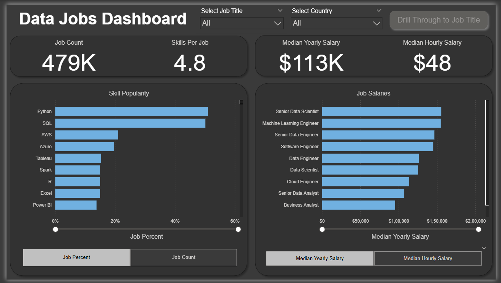
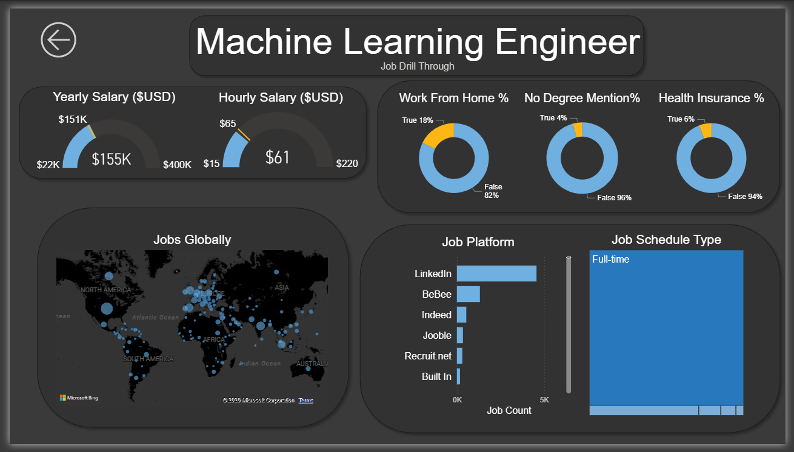

# 📊 Data Jobs Analysis Dashboard

## Overview

This repository contains a **Power BI dashboard project** designed to analyze the global data and technology job market. The dashboard provides insights into **job demand, skill popularity, salary trends, job platforms, work-from-home availability, degree requirements, health insurance mentions, geographic distribution, and job schedule types**.

The project also includes an interactive **Job Title Drill-Through** feature. Users can select any job title from the main dashboard and use the **Drill Through to Job Title** button to navigate to a detailed page that dynamically updates based on the selected role.

This project demonstrates practical skills in **data analysis, data visualization, Power BI, DAX, Power Query, dashboard development, and interactive reporting**.

---

## 🖼️ Dashboard Screenshots

| Screenshot | Description |
| --- | --- |
| **Dashboard Overview**  | Interactive data jobs dashboard displaying job count, skills per job, median salaries, skill popularity, and salary comparisons across data-related roles. |
| **Job Title Drill-Through**  | Dynamic drill-through dashboard providing detailed salary, work-from-home, degree, health insurance, geographic, job platform, and schedule insights for the selected job title. |
---

## 🗂️ Files Included

The project includes the Power BI report, dashboard screenshots, and a ZIP archive containing the required data files.

| **File / Folder**         | **Description**                                                                                                                                                           |
| ------------------------- | ------------------------------------------------------------------------------------------------------------------------------------------------------------------------- |
| `Data_Jobs_Dashboard_2.0` | Power BI report file containing the complete interactive Data Jobs Dashboard, data model, DAX measures, visualizations, filters, and dynamic drill-through functionality. |
| `data.zip`                | ZIP archive containing all the data files used for the project, including the job-postings dataset, monthly data files, and star-schema data files.                       |
| `Page-1`                  | Screenshot of the main Data Jobs Dashboard overview page.                                                                                                                 |
| `Page-2`                  | Screenshot of the dynamic Job Title Drill-Through page.                                                                                                                   |

**Note:** The `data.zip` archive contains the project's **data files only**. Extract the ZIP file to access the datasets used by the Power BI dashboard.                                                                                                         

## 🚀 Dashboard Highlights

- 📊 Analyze **479K data-related job postings**
- 💰 Track **median yearly and hourly salaries**
- 🧑‍💻 Analyze job demand across data and technology roles
- 🛠️ Identify popular skills such as **Python, SQL, AWS, Azure, Tableau, Spark, R, Excel, and Power BI**
- 📈 Compare salary levels across different job titles
- 🌎 Visualize the **global distribution of job postings**
- 🏠 Analyze **work-from-home availability**
- 🎓 Analyze **degree requirements and degree mentions**
- 🏥 Analyze **health insurance mentions**
- 💼 Compare job postings across platforms such as **LinkedIn, Indeed, BeBee, Jooble, Recruit.net, and Built In**
- ⏰ Analyze **job schedule types**
- 🔍 Use interactive **Job Title** and **Country** filters
- 🔄 Use **dynamic drill-through** for any selected job title

---

## 🔍 Dynamic Job Title Drill-Through

The second dashboard page is not limited to a single job title. It works dynamically for **any job title selected from the main dashboard**.

### How it works

1. Select a **Job Title** from the main dashboard.
2. Optionally select a **Country** to narrow the analysis.
3. Click the **Drill Through to Job Title** button.
4. Power BI navigates to the detailed drill-through page.
5. The visuals automatically update based on the selected job title.

The drill-through page can provide:

- 💰 Yearly salary analysis
- 💵 Hourly salary analysis
- 🏠 Work-from-home percentage
- 🎓 Degree requirement analysis
- 🏥 Health insurance analysis
- 🌎 Global job distribution
- 💼 Job platform distribution
- ⏰ Job schedule type

For example, selecting **Machine Learning Engineer** displays Machine Learning Engineer statistics. Selecting **Data Scientist**, **Data Engineer**, **Senior Data Analyst**, or another available role dynamically displays the corresponding job information.

---

## 📈 Key Dashboard Metrics

The overview dashboard displays:

| **Metric** | **Value** |
| --- | ---: |
| Job Count | **479K** |
| Skills Per Job | **4.8** |
| Median Yearly Salary | **$113K** |
| Median Hourly Salary | **$48** |

The exact values and visualizations on the drill-through page change according to the selected job title and filters.

---

## 🛠️ Tools & Technologies

- **Power BI Desktop**
- **Power Query**
- **DAX**
- Data Cleaning & Transformation
- Data Modeling
- Interactive Data Visualization
- Drill-Through Reports
- KPI Cards
- Geographic Mapping
- Interactive Filters & Slicers

---

## 📌 How to Use

1. **Install Power BI Desktop** from [Microsoft Power BI](https://powerbi.microsoft.com/desktop/).
2. Open the `.pbix` Power BI report file.
3. If required, update the source-data path in **Power Query**.
4. Use the **Select Job Title** filter to choose a role.
5. Use the **Select Country** filter to analyze a specific country.
6. Explore the job count, skill popularity, and salary visualizations.
7. Click **Drill Through to Job Title** to open the detailed analysis for the selected role.
8. Use the back button on the drill-through page to return to the main dashboard.

---

## 🎯 Project Objectives

The project was developed to demonstrate how Power BI can be used to transform job-market data into an interactive business intelligence solution.

Key objectives include:

- Analyze job-market demand
- Identify frequently requested technical skills
- Compare compensation across job roles
- Understand geographic job distribution
- Analyze job-platform activity
- Explore remote-work availability
- Examine education and benefit requirements
- Build an interactive drill-through experience

---

## 💡 Skills Demonstrated

- Data Analysis
- Exploratory Data Analysis
- Data Cleaning
- Data Transformation
- Data Modeling
- DAX
- Power Query
- Business Intelligence
- Data Visualization
- Dashboard Design
- Interactive Reporting
- Drill-Through Analysis
- KPI Development
- Salary Analysis
- Job-Market Analytics

---

## 📷 Dashboard Pages

### Page 1 — Data Jobs Dashboard

The main dashboard provides a high-level view of the data-job market, including job volume, average skills per job, salary metrics, skill popularity, and salary comparisons.

### Page 2 — Dynamic Job Title Drill-Through

The second page provides a detailed analysis for **whatever job title is selected** on the main dashboard. The dedicated drill-through button makes it easy to move from the overall job-market view to role-specific analysis.

---

## ⭐ Project Highlights

- Interactive Power BI dashboard
- Dynamic job-title drill-through
- Job-title and country filtering
- Salary and skill analysis
- Global geographic visualization
- Job-platform comparison
- Work-from-home analysis
- Degree and benefit analysis
- DAX-based dashboard metrics
- Business-focused data visualization

---

##  Thank You for Exploring This Project!

**Thank you for taking the time to explore my Data Jobs Dashboard project.**

### — Vedururu Srinivasa Rao —

